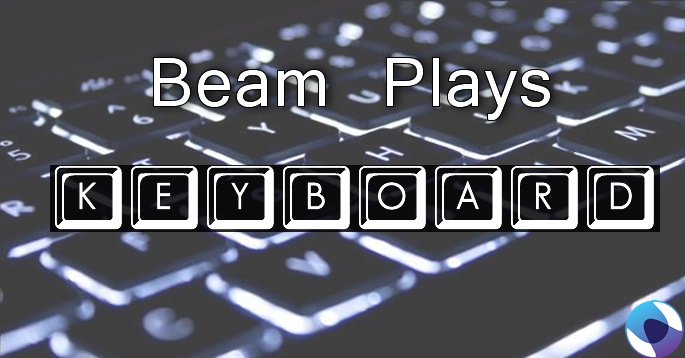

# Beam Plays a Keyboard

Do you want to make a Beam Interactive Game? Quickely? This is for you.

## Requirements
Before Attempting to install this:

You **MUST**:
* Have base knowledge of command line operations in your operating system
* Have a base level of understanding in how npm and node work.
* Have a base level of understanding JSON files and how they should be structured
* Have a beam account
* Understand that this might not work for your game

You **SHOULD**:
* Be Patient
* Ask Questions

I am available via [twitter](https://twitter.com/ProbablePrime) and [Discord](https://discord.gg/0ZMfPTBsKVVHWeIB) for help.


## Setup
Video Coming Soon!

### Placeholders
`<>`'s indicate that you should replace the value and the `<>`'s with an apropriate value suitable to your situtation.
E.G. `<username>` would become `ProbablePrime` in my case.

1. Pick a keyboard controlled game. Any game that allows configureable controls will work yes *ANY*.
2. Make a Controls layout for that game in the Beam Controls Editor ensuring that both holding and frequency are checked for each key and that each key has a valid keycode check [keycode.info](http://keycode.info/) for keycodes.
3. Get yourself [Nodejs](http://Nodejs.org) version 5.x and above is **required** check with `node -v`
4. Download this project as a zip file from the **releases tab*** download JUST the latest release
5. Unzip it.
6. Open a terminal/cmd in its folder
7. Enter `npm install`. This will install project dependancies
8. Choose a keyboard handler see the [Handlers](README.md#handlers) section, I reccomend `robot-js`. Depending on your requirements you may need to use an alternative handler. Please read the section if you are unsure
9. Install your **Selected** handler with `npm install <handler>`
10. Write a config file in config/ called <YOUR GAME>.json example `config/pokemon.json` follow the sample one below for a guide. A video is coming soon.
11. Start your chosen game, Open a cmd/terminal in the folder you downloaded.
12. Enter `node index.js ./config/<YOUR GAME>.json` in the terminal from step 11.
13. If you see "Connected to beam" you should be good to go.
14. Test out your controls.
15. If they do not work, see the [troubleshooting section ](README.md#troubleshooting)

## Config File Specifications

Comments within the file are **Invalid** But are included below here to provide instructions. You can see an example one at
Remove them in your actual config file. Use [config/default.sample.json](config/default.sample.json) as a base/example. always check the file at [jsonlint.com](jsonlint.com) for validity.

```
{
    "beam": {
	//Your Beam username
        "username": "<username>",
        //Your Beam Password
        "password": "<password>",
        //Your Beam channel
        "channel": "<channel name>"
    },
    //Which keyboard handler are you using?
    "handler": "<handler>",

    //Use these two properties to configure the version id and share code. Finding these
    // is detailed in the Sharing your game section
    "version":<versionid>,
    "code":"<sharecode>"
}
```

Always test your config file on a site like jsonlint.com to check that it is valid. If the json file is invalid jsonlint will tell you why. You can read up on [JSON here](http://json.org/) try tracing your document flow through the chart with your finger if you are stuck. You're on github. Now is a fantastic time to learn JSON. Pretty much everything uses it these days.

# Sharing your game

If your game is private or not published. You can use the version id and share code to enable other people (Including yourself to play it). To obtain these visit your controls and click the share button.


Select the second radio button in the popup. Your version id is a number displayed at the **top of the popup**. The share code is in the text box in the middle of the popup:


Place these in your config file ensuring that the file is still valid json:
```
    "version":<versionid>,
    "code":"<sharecode>"
```

# Handlers

3 Handlers are provided to do the actual keypressing when keys are recieved from Beam. They are in order of most reccomended to least:

* robot-js - A new and easy to install cross platform alternative to robotjs
* kbm-robot - Easy to install, Flakey/Unpredictable. Supports DirectInput/XInput games

## Deprecated Handlers
These handlers are hard to install or kludge's for earlier times in this project
* keyboardz - Easy to install, Windows only
* robotjs - Hard to install Robust, Linux/Windows/Mac

To use a handler for your game install it in the same folder as this project with `npm install` so if you chose keyboardz that would be `npm install keyboardz`. Then in your config file change the `"handler":"robotjs",` to `"handler":"keyboardz",`.

## A Warning about kbm-robot

kbm-robot was the intial handler for this project but keys would become stuck after 30 minutes of play. I've attempted to rectify this with a timer that restarts some kbm-robot internals. Please **DO NOT** use kbm-robot on an un-supervised stream. Unfourtunately kbm-robot is also the only handler capable of emitting `DirectX/XInput` compatible events. If your target game uses them robotjs and keyboardz might not work.

# Consensus / Metric / Maths
With potentially 100s of people pushing the buttons we need some way to decide if a button should be pushed.

Beam currently provides in each report:
* the number of people who've used the controls at various intervals(now, 10s,20s,30s..etc)
* the number of people watching the stream
* For each button:
   * The number of people holding a button down
   * the number of button pushes
   * the number of button releases

We support multiple Consensus algorithms but for now the default is called "Democracy" it works as follows:

* Calculate a percentage value for holding, releasing, pushing for this report
* For Each Button:
    * If the percent of people holding the button down this report is greater or equal to the threshold value(defaults to 50%)
    * Push the button.
    * Else Release the button.

If you can think of a better Metric. Please feel free to PR.

# Advanced Configuration

## Blocks
You can specify an optional configuration attribute called "blocks" which will block certain keys from being held down at the same time.

For example:
```
"blocks": {
  "start":"select",
  "select":"start"
}
```
Will prevent people from being able to push both select and start at the same time. This is helpful as it prevents soft resets.
In older games.

# Troubleshooting

## Errors on startup.

Try reading the first line of the error, Some of them will be in plain english and should tell you exactly whats wrong. If you can't understand the error then contact me :).

## Controls Do not work

Check your keybindings for the game they should match the keys you are pressing. Press the actual keys on your keyboard to check.

Try refreshing the beam page.

Are you focused on/in your game. You must have your mouse inside the game for the keys to register.

Try `kbm-robot` as your handler some require this to interface with DirectInput/XInput.

Try from another device. As this pushes your physical keys, its often impossible to test on the same machine as an infinite loop of key presses occurs. Summon a friend into your channel to help test :).

Try The key without a spark cost or cooldown.

Set your threshold to `0.1` in the config file

Contact me

#Example Game Setups
* [Sega Collection](docs/SegaCollection.MD)
* [Visual Boy Advance](docs/VBA.MD)
